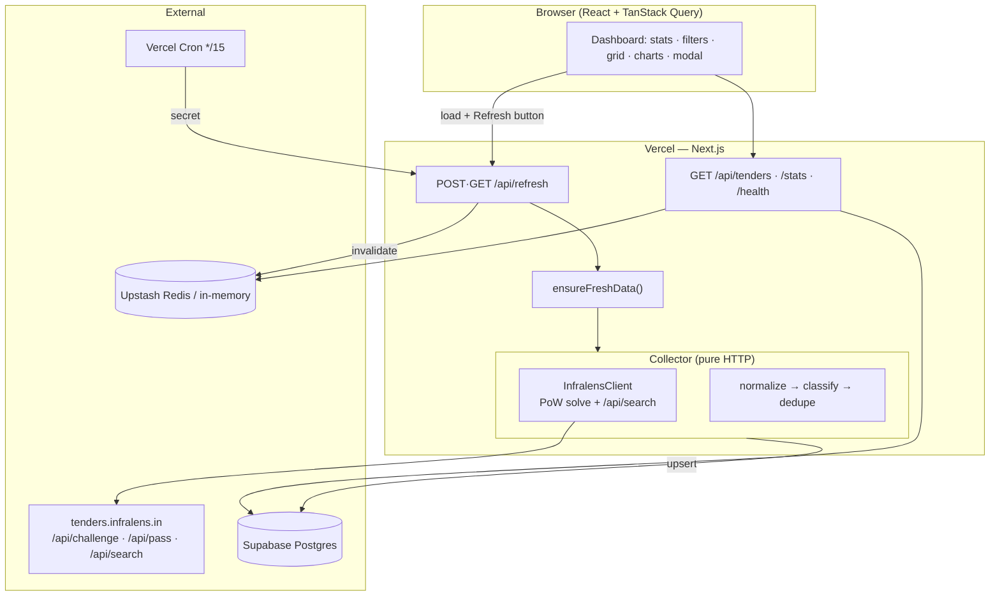
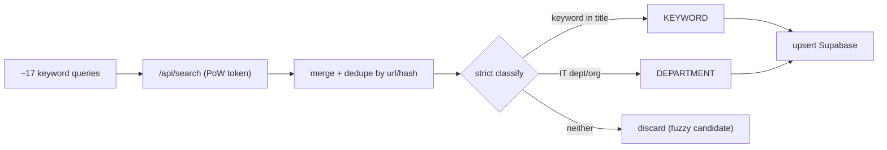
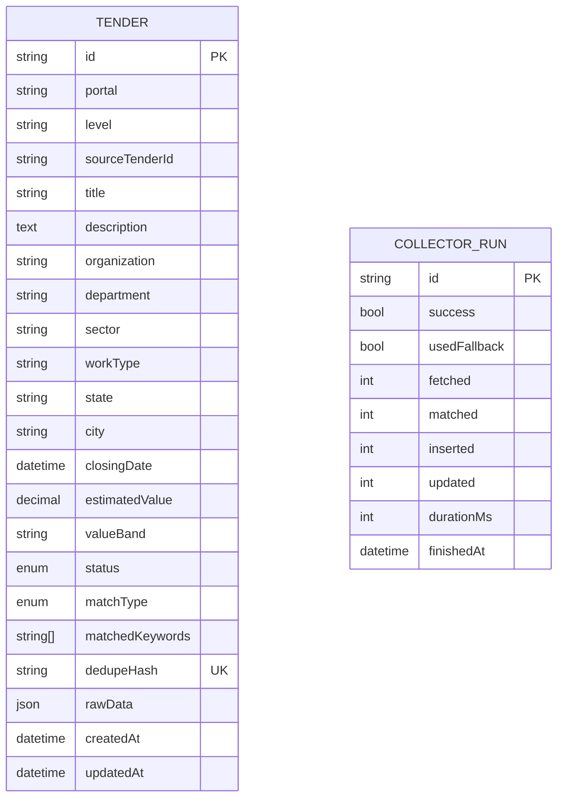

# Architecture

A single Next.js app on Vercel does everything — UI, read APIs, and the live
collector — because the data source is reachable over plain HTTP. There is no
browser and no separate worker.

## The proof-of-work gate

`tenders.infralens.in/api/search` returns `{ token_required: true }` until a PoW
is solved:

1. `GET /api/challenge` → `{ c, zeros }`
2. find `n` such that `sha256(`${c}:${n}`)` starts with `zeros` hex zeros
   (`zeros=3` → ~4096 hashes, milliseconds)
3. `POST /api/pass { c, n }` → sets the `bqs` access cookie
4. `GET /api/search?q=…` with that cookie → structured JSON

`InfralensClient` implements this with Node `crypto`, caches the cookie (~80 min)
in Redis/in-memory, and transparently re-solves on `token_required`. Pure HTTP →
runs inside a Vercel function.

## Request lifecycles

- **Dashboard load** → `POST /api/refresh?force=false`: refreshes only if the
  last run is older than 3 min (lock-protected), then the list/stats queries
  read Supabase. So the UI shows the freshest data without hammering the source.
- **Refresh button** → `POST /api/refresh?force=true`: always live-fetches.
- **Cron** → `GET /api/refresh` (Bearer `CRON_SECRET`): keeps Supabase fresh
  every 15 min even with no visitors.

## Collector pipeline

Keyword detection runs on the tender's **own title text** (not categorical
fields), with word-boundary matching and exact short-acronym handling. The
department override keys off `department`/`organization`. Results matching
neither are dropped — the aggregator's fuzzy search is only a candidate source.

## Database schema

`dedupeHash` is unique; indexes on `portal`, `matchType`, `department`,
`sector`, `state`, `closingDate`, `status` keep filtering/sorting fast.
